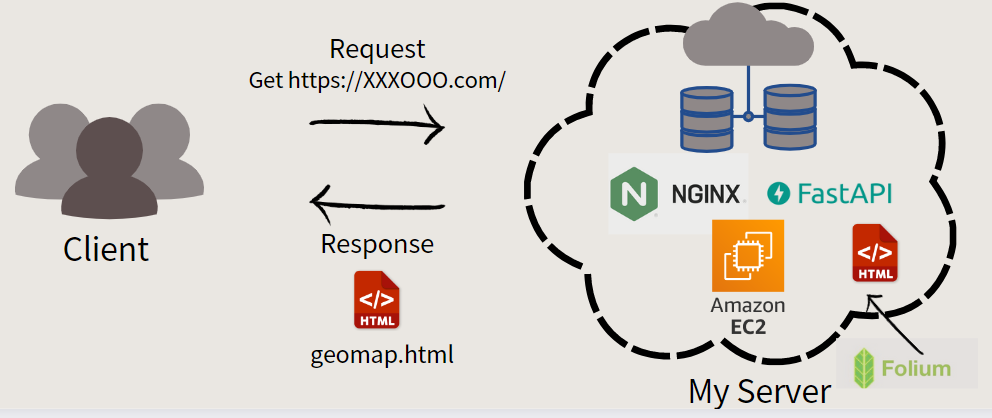
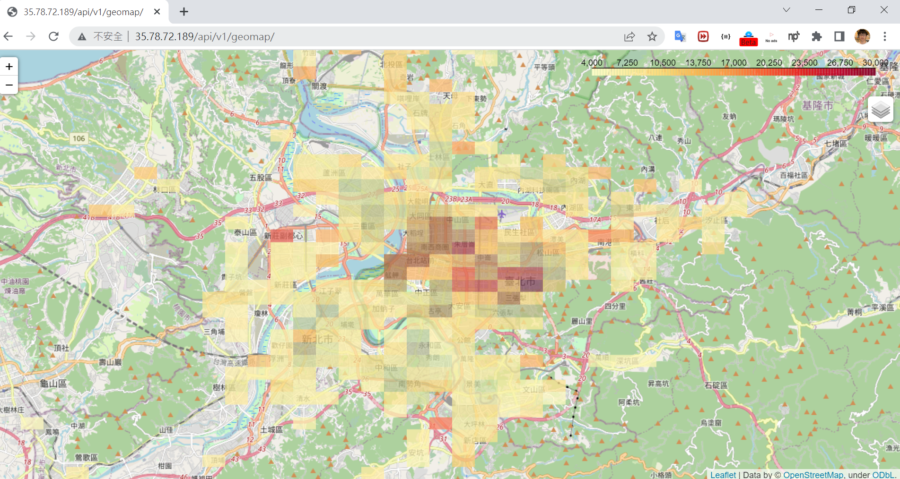
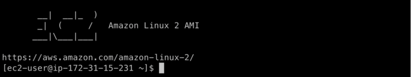
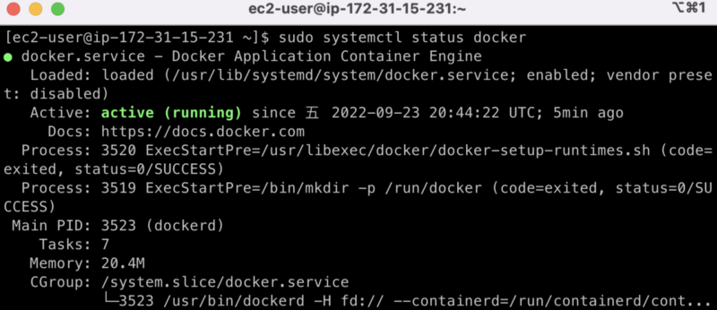
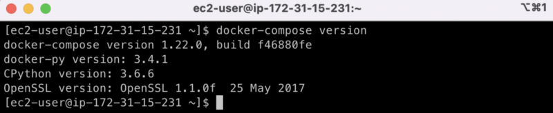
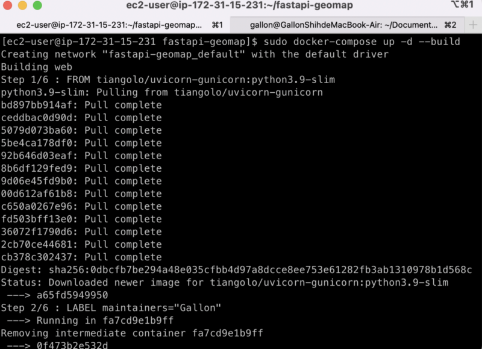

# FastAPI Geo-map

It is a simple web practice combined with AWS EC2, FastAPI and Geo-map.  
In this repo, you can show geo-map generated from folium on your own website and share the links to others.

[Demo URL](http://35.78.72.189/api/v1/geomap/)





---

<!-- GETTING STARTED -->
## Getting Started

### Prerequisites
- Have your own AWS account.
- Start up an EC2 with **Amazon Linux 2 AMI** and ensure connection.
- Ref:  
[Tutorial: Get started with Amazon EC2 Linux instances](https://docs.aws.amazon.com/zh_tw/AWSEC2/latest/UserGuide/EC2_GetStarted.html)  
[Work with security groups](https://docs.aws.amazon.com/zh_tw/AWSEC2/latest/UserGuide/working-with-security-groups.html)

When connecting the EC2, you would see the screen below:


First of all, we update yum.
```bash
sudo yum update
```

Install Docker and start up.
```bash
sudo amazon-linux-extras install docker
sudo usermod -a -G docker ec2-user
sudo systemctl enable docker
sudo systemctl start docker
sudo systemctl status docker
```



Install Docker-Compose and link it to sudo.
```bash
sudo curl -L https://github.com/docker/compose/releases/download/1.22.0/docker-compose-$(uname -s)-$(uname -m) -o /usr/local/bin/docker-compose

sudo chmod +x /usr/local/bin/docker-compose

sudo ln -s /usr/local/bin/docker-compose /usr/bin/docker-compose
```


Now, install git and then download this github repo.
```bash
sudo yum install git

git clone https://github.com/GallonShih/fastapi-geomap.git
```

Enter the fastapi-geomap folder and build the docker.
```bash
cd fastapi-geomap
sudo docker-compose up -d --build
```
At the first time, you must wait for few seconds.


So far, we start up a local web server on AWS EC2. However, we want to let other people can visit this website by specific URL. Thus, we must to do some other settings.

Install Nginx and start up.
```bash
sudo amazon-linux-extras install nginx1 -y
sudo systemctl enable nginx
sudo systemctl start nginx
```

Create nginx conf file.
```bash
sudo vi /etc/nginx/conf.d/fastapi.conf
```
The demo setting conf file just likes below:
```
server {
    listen 80;
    server_name {your own aws ec2 IP};
location / {
        proxy_pass http://127.0.0.1:8008;
    }
}
```
And reload the nginx.
```bash
sudo nginx -s reload
```

Now, you can use your browser to get **http://{your own aws ec2 IP}/api/v1/geomap/**

---

<!-- CONTACT -->
## Contact
* **[Gallon Shih](https://github.com/GallonShih)**
